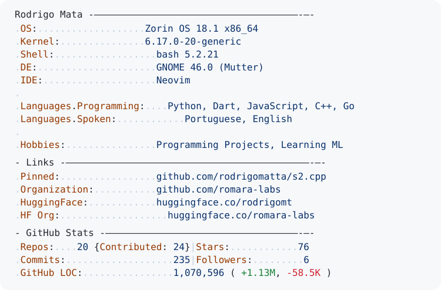

<a href="https://github.com/rodrigomatta">
  <picture>
    <source media="(prefers-color-scheme: dark)" srcset="./dark_mode.svg">
    
  </picture>
</a>

<picture>
  <source media="(prefers-color-scheme: dark)" srcset="https://raw.githubusercontent.com/rodrigomatta/rodrigomatta/output/github-contribution-grid-snake-dark.svg">
  <source media="(prefers-color-scheme: light)" srcset="https://raw.githubusercontent.com/rodrigomatta/rodrigomatta/output/github-contribution-grid-snake.svg">
  
</picture>

  

